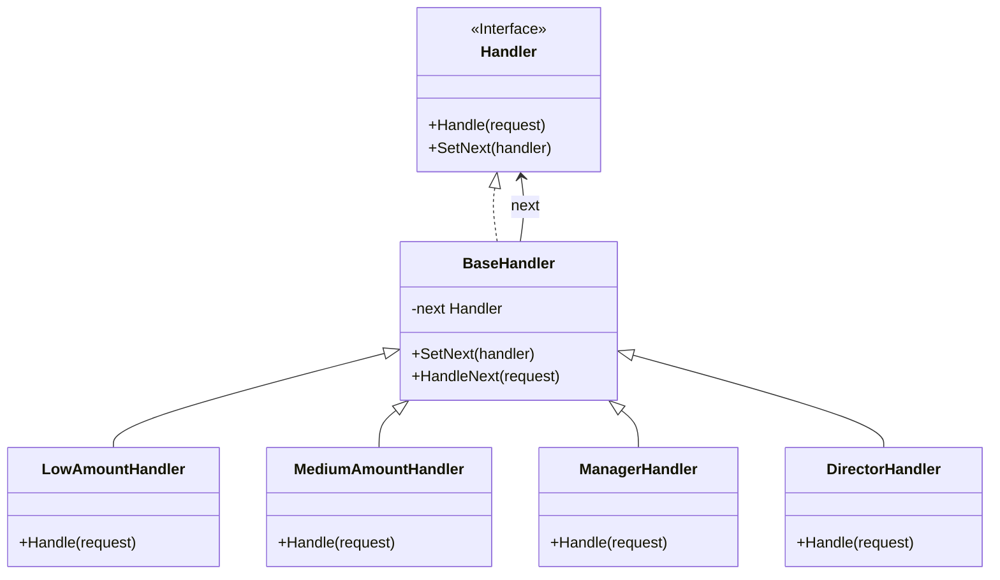
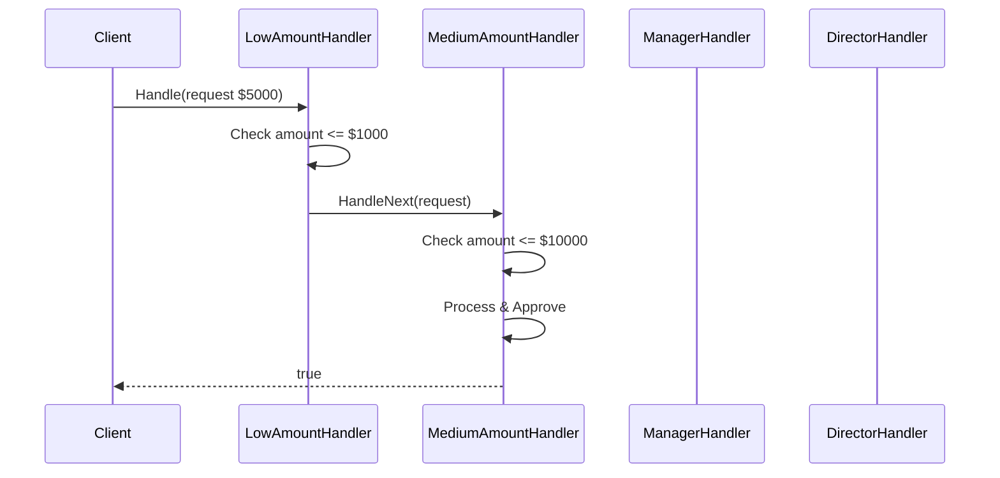

# Chain of Responsibility Pattern

## Problem Statement

When a request needs to be processed by multiple handlers:
- Don't want to hardcode which handler processes which request
- Multiple objects should have a chance to handle the request
- Handler should be determined at runtime
- Want to decouple sender from receiver

## Real-World Scenario

**JoshBank Transaction Approval System**: JoshBank processes transactions that require approval based on amount. Small transactions are auto-approved, medium amounts need supervisor approval, large amounts need manager approval, and very large amounts need director approval. Each handler decides whether to approve or escalate to the next level.

## Core Components

1. **Handler Interface**: Defines method for handling requests and setting next handler
2. **Concrete Handlers**: Implement handling logic and decide to process or pass
3. **Client**: Initiates request to the first handler in chain

## Diagrams

### Class Diagram



### Sequence Diagram



## Implementation Walkthrough

1. **Define Handler Interface**: Methods for handling and chaining
2. **Create Base Handler**: Common chaining logic
3. **Implement Concrete Handlers**: Each with specific handling logic
4. **Build Chain**: Link handlers together
5. **Send Request**: Client sends to first handler, chain processes

## When to Use

✅ **Use when:**
- Multiple objects can handle a request
- Handler should be determined at runtime
- Want to decouple sender from receivers
- Set of handlers can change dynamically

⚠️ **Cautions:**
- Request might not be handled by anyone
- Can be hard to debug the chain
- Performance impact with long chains
- Order of handlers matters

## Running the Example

```bash
cd behavioral/chain-of-responsibility
go run main.go
```

## Key Takeaways

- Chain of Responsibility passes requests along a chain
- Each handler decides to process or pass to next
- Decouples sender from receiver
- Handlers can be added/removed dynamically
