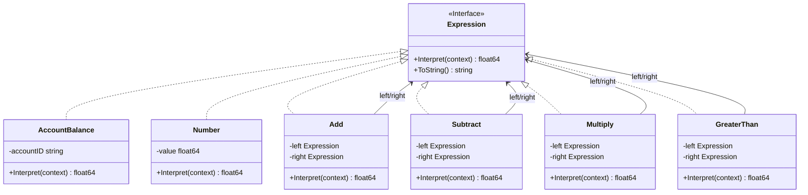
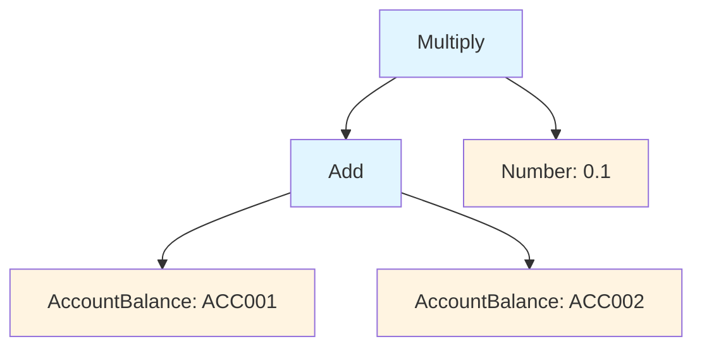

# Interpreter Pattern

## Problem Statement

When you need to interpret sentences in a language:
- Have a simple grammar to interpret
- Efficiency is not a critical concern
- Want to represent grammar rules as classes
- Need to evaluate expressions

## Real-World Scenario

**JoshBank Transaction Query Language**: JoshBank needs to evaluate financial expressions and queries like "ACC001 + ACC002", "(ACC001 + ACC002) * 0.1", or "ACC001 > 10000". Interpreter pattern represents each grammar rule (account balance, addition, comparison) as a class and evaluates the expression tree, enabling flexible transaction queries and rule evaluation.

## Core Components

1. **Abstract Expression**: Declares interpret method (Expression)
2. **Terminal Expression**: Implements interpret for terminal symbols (AccountBalance, Number)
3. **Non-Terminal Expression**: Implements interpret for grammar rules (Add, Subtract, GreaterThan)
4. **Context**: Contains global information for interpretation (account balances)

## Diagrams

### Class Diagram



### Expression Tree Example



## When to Use

✅ **Use when:**
- Grammar is simple
- Efficiency is not critical
- Want to represent grammar as classes

⚠️ **Cautions:**
- Complex grammars are hard to maintain
- Performance can be poor
- Consider parser generators for complex grammars

## Running the Example

```bash
cd behavioral/interpreter
go run main.go
```

## Key Takeaways

- Interpreter represents grammar as class hierarchy
- Easy to change and extend grammar
- Each grammar rule is a separate class
- Useful for simple languages and expressions
