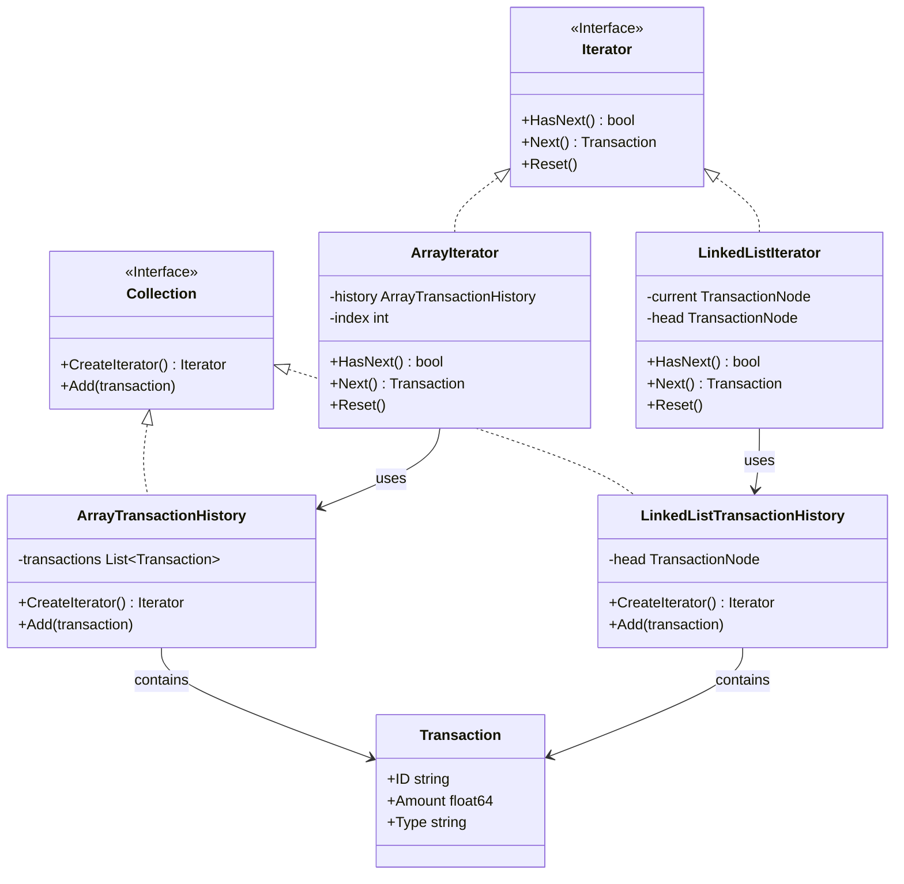
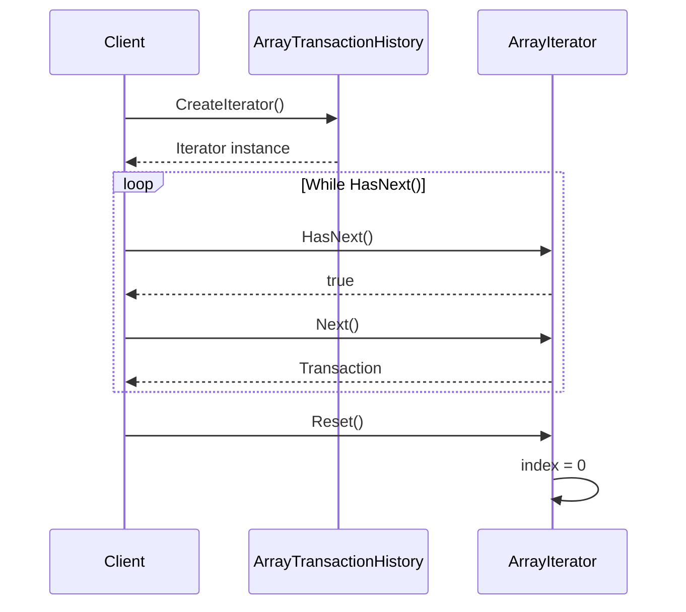

# Iterator Pattern

## Problem Statement

When you need to traverse a collection without exposing its internal structure:
- Different collections have different traversal methods
- Want multiple simultaneous traversals
- Need uniform interface for different collections
- Should hide collection implementation details

## Real-World Scenario

**JoshBank Transaction History**: JoshBank stores transaction history in different data structures (arrays, linked lists, databases). Iterator provides uniform way to traverse transactions regardless of underlying storage, allowing clients to iterate through transaction history without knowing implementation details.

## Core Components

1. **Iterator Interface**: Defines traversal methods (Next, HasNext, Reset)
2. **Concrete Iterator**: Implements traversal for specific collection
3. **Aggregate Interface**: Declares method to create iterator (Collection)
4. **Concrete Aggregate**: Returns appropriate iterator

## Diagrams

### Class Diagram



### Sequence Diagram



## When to Use

✅ **Use when:**
- Need to traverse collection without exposing internals
- Support multiple traversal algorithms
- Provide uniform interface for different collections

## Running the Example

```bash
cd behavioral/iterator
go run main.go
```

## Key Takeaways

- Iterator provides uniform traversal interface
- Hides collection implementation details
- Supports multiple simultaneous traversals
- Common pattern in Go for range loops and collections
