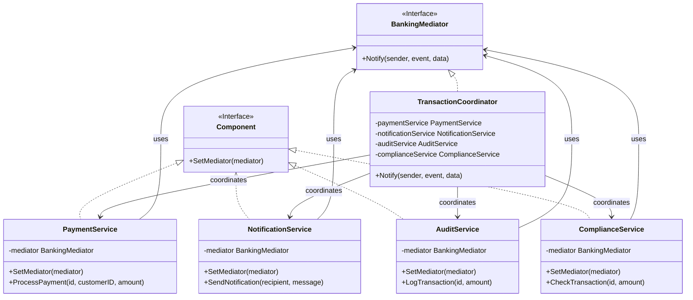
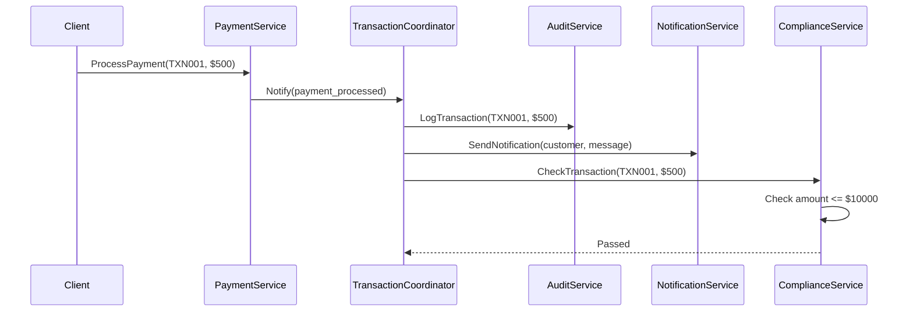

# Mediator Pattern

## Problem Statement

When objects communicate directly, it creates tight coupling:
- Many-to-many relationships become complex
- Hard to understand and maintain interactions
- Difficult to reuse objects independently
- Changes ripple through multiple classes

## Real-World Scenario

**JoshBank Transaction Coordination**: JoshBank has multiple services (Payment Service, Notification Service, Audit Service, Compliance Service) that need to coordinate when processing transactions. Instead of each service communicating directly with others, they communicate through a Transaction Coordinator (mediator), which manages all interactions and prevents tight coupling.

## Core Components

1. **Mediator Interface**: Defines communication interface (BankingMediator)
2. **Concrete Mediator**: Coordinates communication between colleagues (TransactionCoordinator)
3. **Colleague**: Objects that communicate through mediator (PaymentService, NotificationService, etc.)

## Diagrams

### Class Diagram



### Sequence Diagram



## When to Use

✅ **Use when:**
- Objects communicate in complex ways
- Reusing objects is difficult due to dependencies
- Behavior distributed across classes should be customizable

## Running the Example

```bash
cd behavioral/mediator
go run main.go
```

## Key Takeaways

- Mediator centralizes complex communications
- Reduces coupling between objects
- Makes interactions easier to understand and maintain
- Common pattern for coordinating multiple subsystems
