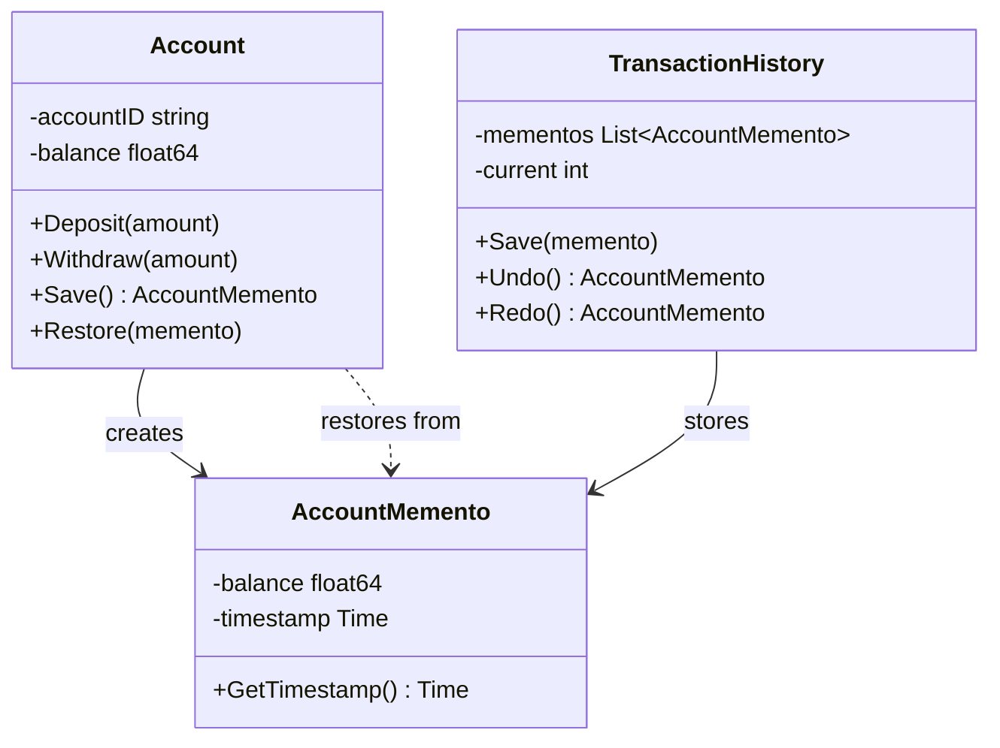
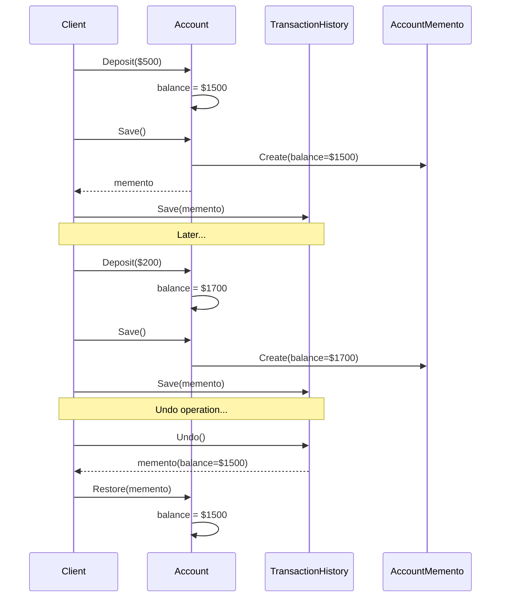

# Memento Pattern

## Problem Statement

When you need to save and restore object state:
- Want undo/redo functionality
- Need to capture state without violating encapsulation
- State should be saved externally
- Rollback to previous states required

## Real-World Scenario

**JoshBank Account State Management**: JoshBank needs to support transaction rollback and account state restoration. Memento captures account balance at each transaction, allowing the system to revert to previous states for error recovery or audit purposes without exposing internal account structure.

## Core Components

1. **Originator**: Object whose state needs to be saved (Account)
2. **Memento**: Stores originator's state (AccountMemento)
3. **Caretaker**: Manages mementos (TransactionHistory)

## Diagrams

### Class Diagram



### Sequence Diagram



## When to Use

✅ **Use when:**
- Need to save/restore object state
- Want undo/redo functionality
- Direct state access violates encapsulation

## Running the Example

```bash
cd behavioral/memento
go run main.go
```

## Key Takeaways

- Memento captures and restores object state
- Enables undo/redo functionality
- Preserves encapsulation
- Common pattern for state management
