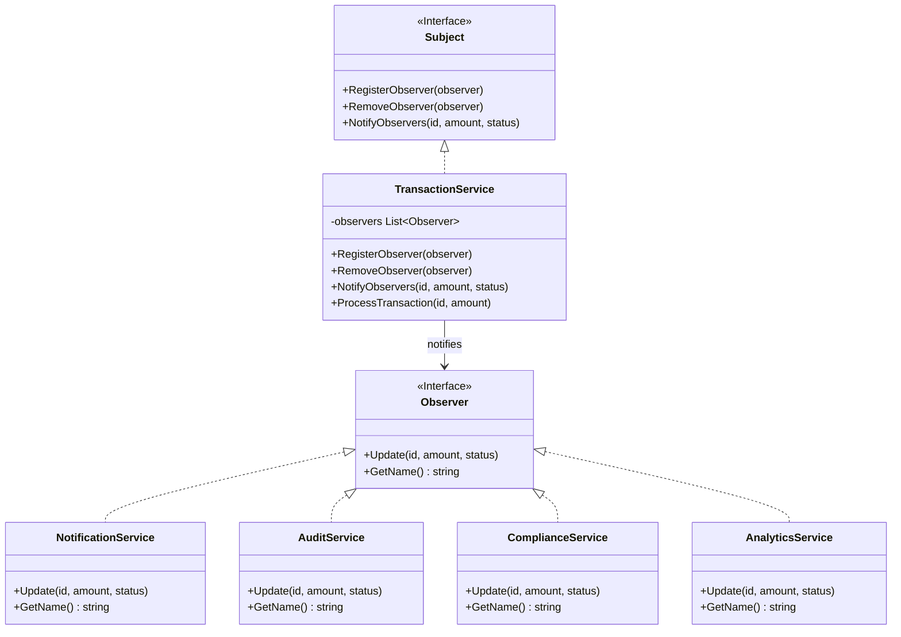
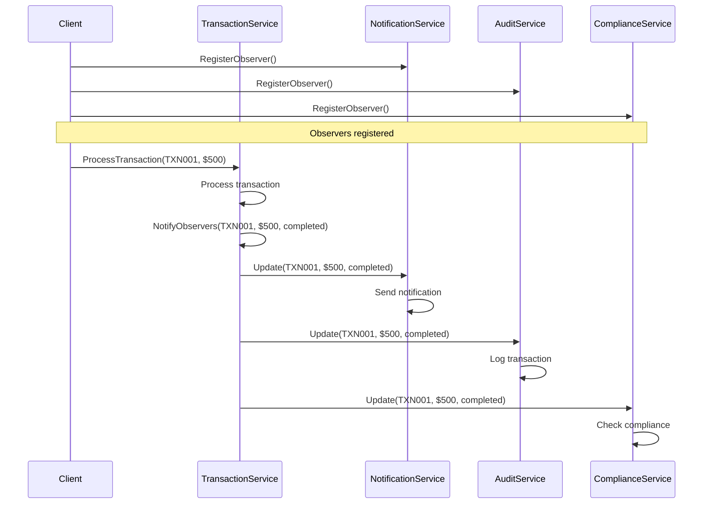

# Observer Pattern

## Problem Statement

When one object's state change should notify multiple dependents:
- Many objects depend on another object's state
- Don't know number of dependents in advance
- Want loose coupling between subject and observers
- Broadcast communication needed

## Real-World Scenario

**JoshBank Transaction Monitoring**: When JoshBank processes a transaction, multiple services need to be notified: Notification Service (send alerts), Audit Service (log transaction), Compliance Service (check regulations), Analytics Service (update metrics). Observer pattern allows these services to subscribe to transaction events and react automatically.

## Core Components

1. **Subject**: Maintains list of observers, notifies them of changes (TransactionService)
2. **Observer Interface**: Defines update method
3. **Concrete Observers**: Implement update to react to changes (NotificationService, AuditService, etc.)

## Diagrams

### Class Diagram



### Sequence Diagram



## When to Use

✅ **Use when:**
- Change to one object requires changing others
- Object should notify others without knowing who they are
- Loose coupling between subject and observers needed

## Running the Example

```bash
cd behavioral/observer
go run main.go
```

## Key Takeaways

- Observer enables one-to-many dependencies
- Subject and observers are loosely coupled
- Observers can be added/removed dynamically
- Common pattern for event-driven systems
