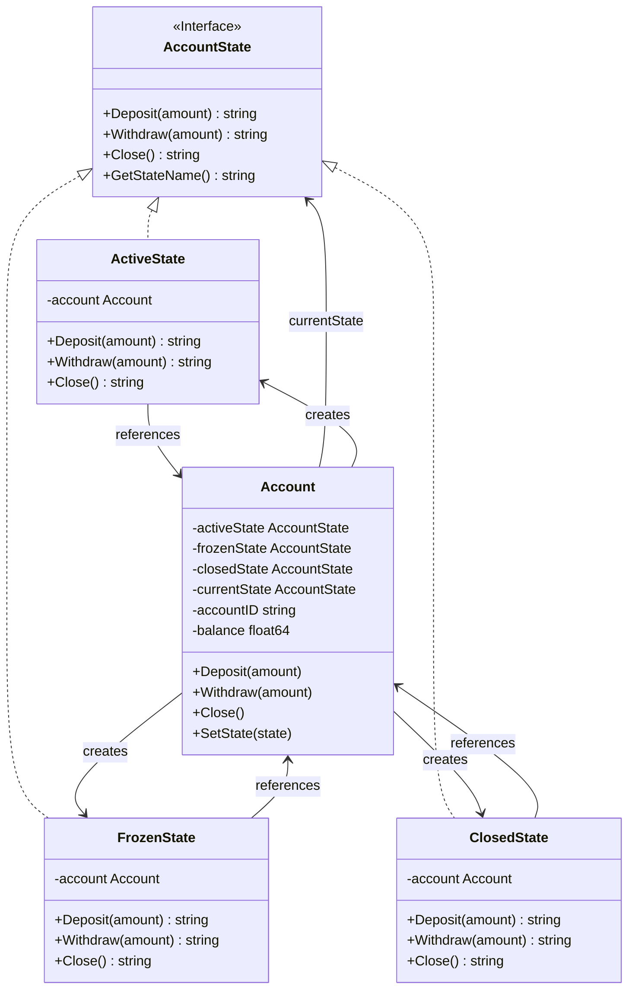
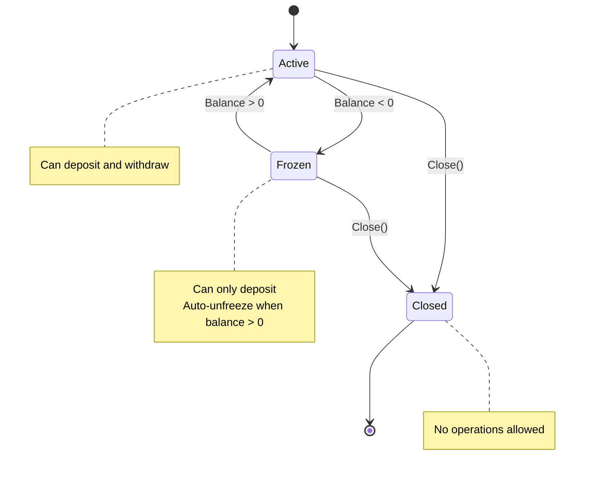

# State Pattern

## Problem Statement

When object behavior changes based on internal state:
- Large conditional statements based on state
- State-specific behavior scattered across methods
- Adding new states requires modifying existing code
- State transitions are complex

## Real-World Scenario

**JoshBank Account States**: JoshBank accounts have different states (Active, Frozen, Closed). Available operations and behavior depend on current state. Active accounts allow deposits and withdrawals, frozen accounts only allow deposits, and closed accounts allow no operations. State pattern encapsulates state-specific behavior.

## Core Components

1. **Context**: Maintains current state, delegates to state object (Account)
2. **State Interface**: Defines state-specific behavior (AccountState)
3. **Concrete States**: Implement behavior for each state (ActiveState, FrozenState, ClosedState)

## Diagrams

### Class Diagram



### State Transition Diagram



## When to Use

✅ **Use when:**
- Object behavior depends on state
- Large conditionals based on state
- State transitions are complex

## Running the Example

```bash
cd behavioral/state
go run main.go
```

## Key Takeaways

- State pattern encapsulates state-specific behavior
- Eliminates complex conditionals
- Easy to add new states
- Makes state transitions explicit
