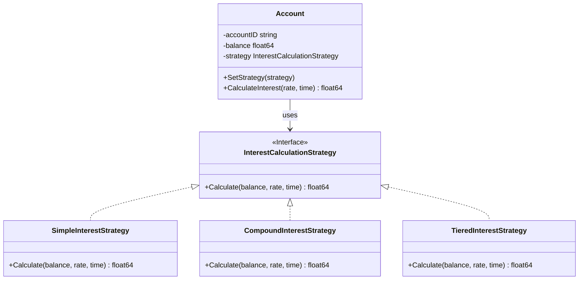
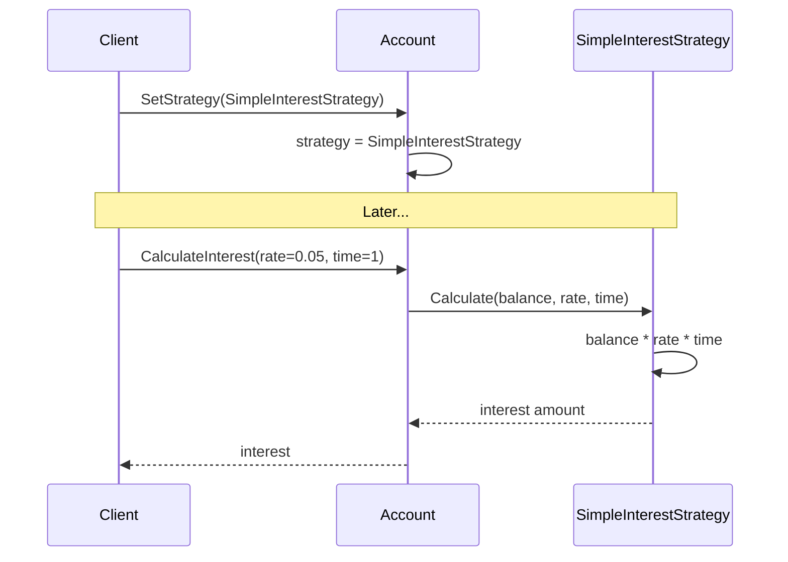

# Strategy Pattern

## Problem Statement

When you have multiple algorithms for a task:
- Need to switch between algorithms at runtime
- Algorithms should be interchangeable
- Don't want conditional logic for algorithm selection
- Want to isolate algorithm implementation

## Real-World Scenario

**JoshBank Interest & Fee Calculation**: JoshBank offers different interest calculation methods (Simple, Compound, Tiered) and fee structures (Flat Fee, Percentage Fee). Customers can choose or the bank can switch strategies based on account type. Strategy pattern encapsulates each calculation algorithm, making them interchangeable.

## Core Components

1. **Strategy Interface**: Defines algorithm interface (InterestCalculationStrategy)
2. **Concrete Strategies**: Implement different algorithms (SimpleInterestStrategy, CompoundInterestStrategy)
3. **Context**: Uses a strategy to execute algorithm (Account)

## Diagrams

### Class Diagram



### Sequence Diagram



## When to Use

✅ **Use when:**
- Many related classes differ only in behavior
- Need different variants of an algorithm
- Algorithm uses data clients shouldn't know about

## Running the Example

```bash
cd behavioral/strategy
go run main.go
```

## Key Takeaways

- Strategy defines family of algorithms
- Makes algorithms interchangeable
- Eliminates conditional statements
- Easy to add new strategies
