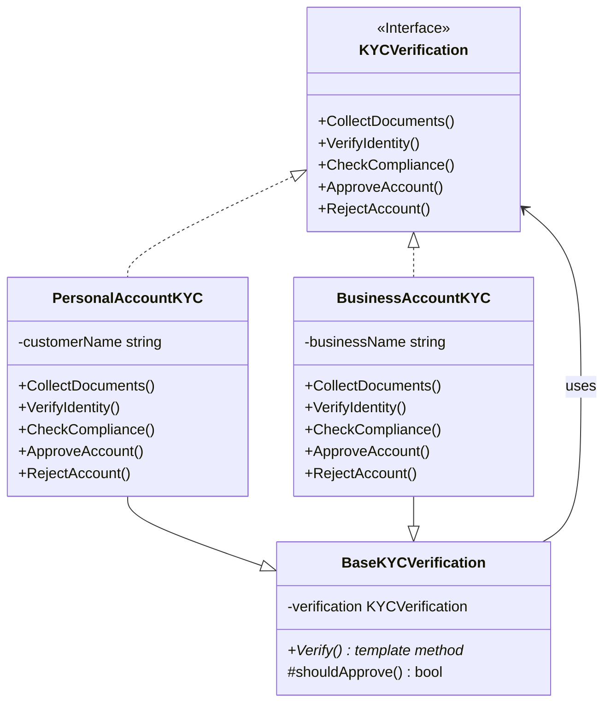
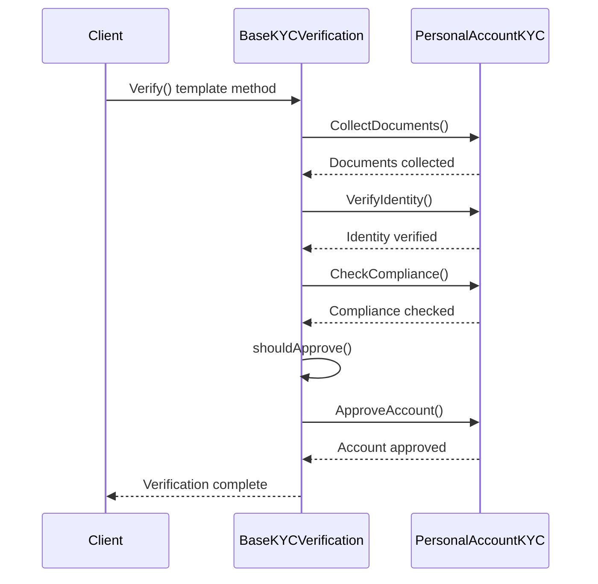

# Template Method Pattern

## Problem Statement

When algorithms have similar structure but differ in steps:
- Multiple classes with similar algorithms
- Want to avoid code duplication
- Need to enforce algorithm structure
- Allow subclasses to override specific steps

## Real-World Scenario

**JoshBank KYC & Loan Approval**: JoshBank has standardized processes for KYC verification and loan approval. Both follow similar steps (collect documents, verify identity, check compliance, approve/reject), but the specific implementation differs for personal vs business accounts. Template method defines the algorithm skeleton, letting subclasses override specific steps while maintaining the overall process structure.

## Core Components

1. **Abstract Class**: Defines template method and abstract steps
2. **Concrete Classes**: Implement abstract steps
3. **Template Method**: Defines algorithm structure (final)

## Diagrams

### Class Diagram



### Sequence Diagram



## When to Use

✅ **Use when:**
- Multiple classes have similar algorithms
- Want to control algorithm structure
- Common behavior should be in one place

## Running the Example

```bash
cd behavioral/template-method
go run main.go
```

## Key Takeaways

- Template method defines algorithm skeleton
- Subclasses override specific steps
- Promotes code reuse
- Enforces algorithm structure
