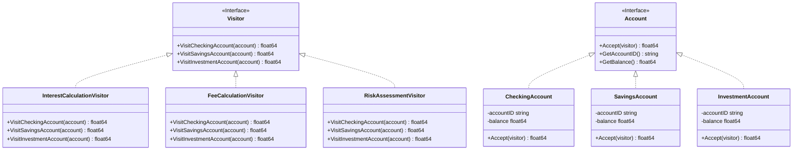
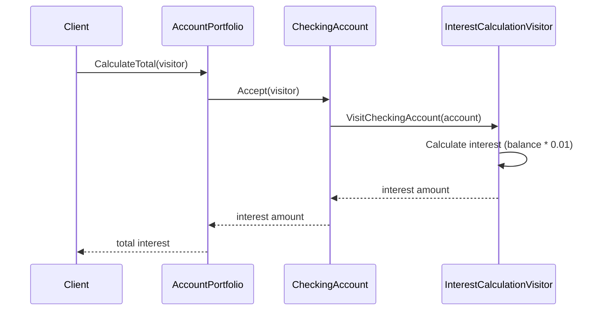

# Visitor Pattern

## Problem Statement

When you need to perform operations on object structure:
- Want to add operations without modifying classes
- Operations should be separate from object structure
- Many unrelated operations on objects
- Object structure rarely changes but operations do

## Real-World Scenario

**JoshBank Account Analysis**: JoshBank has different account types (Checking, Savings, Investment). Various operations need to be performed on accounts (interest calculation, fee calculation, risk assessment). Visitor pattern allows adding new analysis operations without modifying account classes, keeping operations separate from account structure.

## Core Components

1. **Visitor Interface**: Declares visit method for each element type
2. **Concrete Visitor**: Implements operations for each element (InterestCalculationVisitor, FeeCalculationVisitor)
3. **Element Interface**: Declares accept method (Account)
4. **Concrete Elements**: Implement accept to call appropriate visit method

## Diagrams

### Class Diagram



### Sequence Diagram



## When to Use

✅ **Use when:**
- Need many unrelated operations on object structure
- Object structure is stable but operations change
- Want to avoid polluting classes with operations

## Running the Example

```bash
cd behavioral/visitor
go run main.go
```

## Key Takeaways

- Visitor adds operations without modifying elements
- Separates algorithms from object structure
- Easy to add new operations
- Operations are centralized in visitor classes
