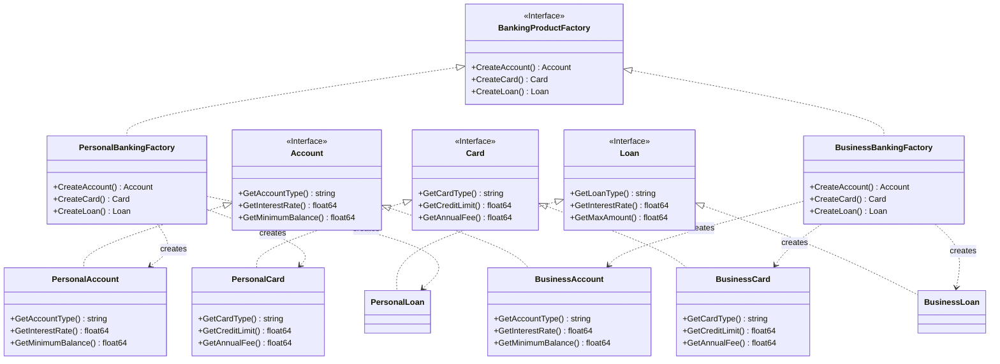
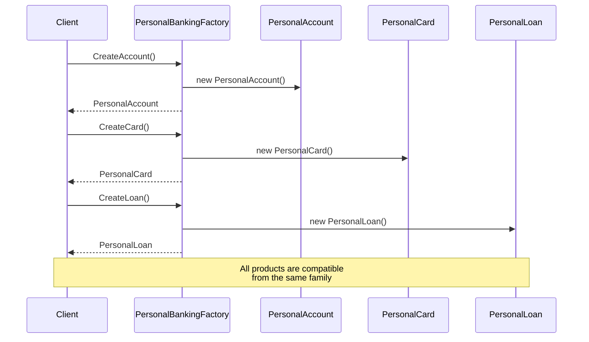

# Abstract Factory Pattern

## Problem Statement

When you need to create families of related objects without specifying their concrete classes, you face challenges:
- Ensuring created objects are compatible with each other
- Supporting multiple product families (themes, platforms, etc.)
- Maintaining consistency across related objects

## Real-World Scenario

**JoshBank Product Families**: JoshBank offers different banking product families for Personal and Business customers. Each family includes compatible products (Account, Card, Loan) that work together. Personal customers get checking accounts with debit cards, while Business customers get business accounts with credit cards and higher loan limits. You can't mix products from different families.

## Core Components

1. **Abstract Factory Interface**: Declares methods for creating each product type
2. **Concrete Factories**: Implement the factory interface for each product family
3. **Abstract Product Interfaces**: Define interfaces for each product type
4. **Concrete Products**: Implement product interfaces for each family
5. **Client Code**: Uses factories and products through their interfaces

## Diagrams

### Class Diagram



### Sequence Diagram



## Implementation Walkthrough

1. **Define Product Interfaces**: Account, Card, Loan, etc.
2. **Create Concrete Products**: PersonalAccount, BusinessAccount, etc.
3. **Define Factory Interface**: Methods to create each product
4. **Implement Concrete Factories**: One for each customer type
5. **Client Uses Factory**: Gets all products from one factory

## When to Use

✅ **Use when:**
- System needs to work with multiple families of related products
- You want to ensure products from the same family are used together
- You need to provide a library of products without exposing implementations
- Product families may be added in the future

⚠️ **Cautions:**
- Can be complex with many product types
- Adding new product types requires changing all factories
- May be overkill for simple scenarios

## Running the Example

```bash
cd creational/abstract-factory
go run main.go
```

## Key Takeaways

- Abstract Factory creates families of related objects
- Ensures compatibility between products from the same family
- Isolates concrete classes from client code
- Makes exchanging product families easy
