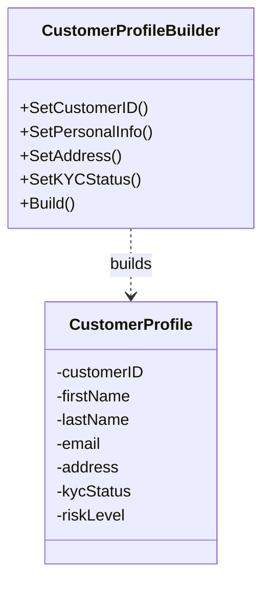

# Builder Pattern

## Problem Statement

Creating complex objects with many optional parameters can be challenging:
- Constructors with many parameters become unwieldy
- Telescoping constructors lead to confusion
- Object may be in invalid state during construction
- Hard to read and maintain

## Real-World Scenario

**JoshBank Customer Profile Builder**: Building customer profiles requires setting many optional fields (personal info, address, KYC status, risk level, preferences, metadata). A builder provides a fluent interface to construct profiles step by step with clear, readable code. This is especially useful during customer onboarding at JoshBank.

## Core Components

1. **Product**: The complex object being built (CustomerProfile)
2. **Builder Interface**: Declares construction steps
3. **Concrete Builder**: Implements construction steps and assembles the product
4. **Director (Optional)**: Orchestrates building steps in a specific order
5. **Fluent Interface**: Methods return the builder for method chaining

## Structure



## Implementation Walkthrough

1. **Define Product**: Create the complex object structure
2. **Create Builder**: Struct that accumulates construction parameters
3. **Add Builder Methods**: Each method sets a parameter and returns the builder
4. **Implement Build()**: Validates and constructs the final product
5. **Use Fluent API**: Chain method calls for readable construction

## When to Use

✅ **Use when:**
- Object has many optional parameters
- Construction process is complex or has multiple steps
- You want to create different representations of an object
- Immutable objects need complex initialization

⚠️ **Cautions:**
- Adds more code and complexity
- May be overkill for simple objects
- Consider functional options pattern in Go as an alternative

## Running the Example

```bash
cd creational/builder
go run main.go
```

## Key Takeaways

- Builder separates construction from representation
- Provides fluent, readable API for object creation
- Allows step-by-step construction of complex objects
- Common in Go for configuring complex structs
