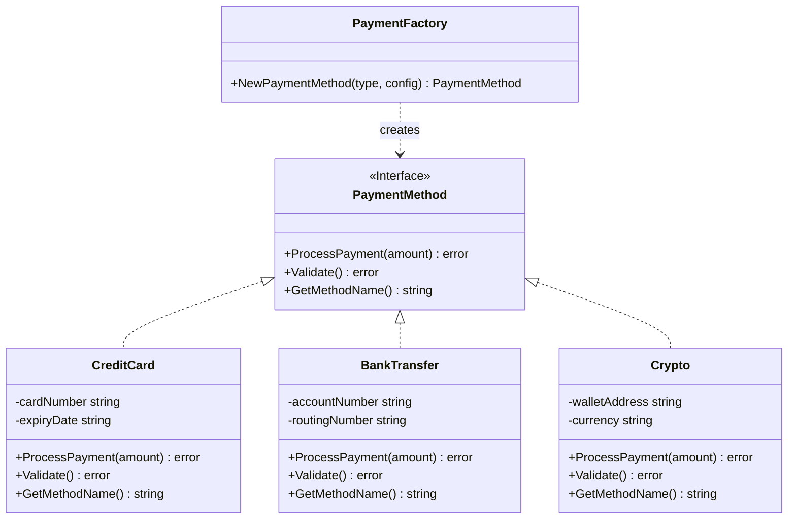
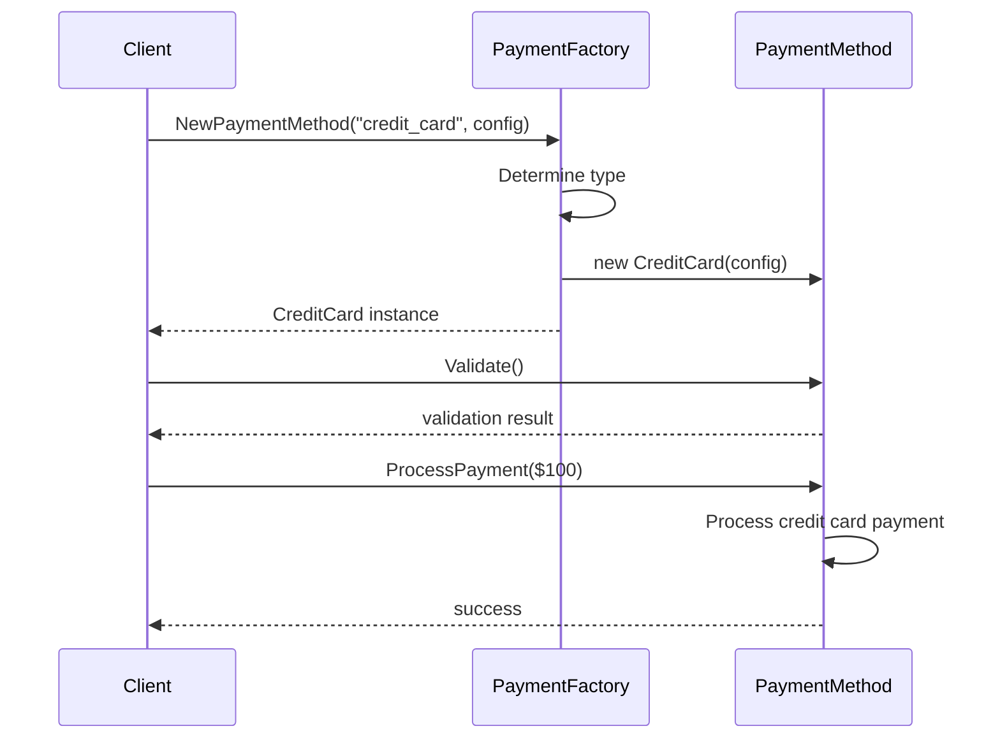

# Factory Method Pattern

## Problem Statement

When creating objects, we often need flexibility in determining which class to instantiate. Hardcoding object creation throughout the code makes it:
- Difficult to add new types
- Hard to maintain when creation logic changes
- Tightly coupled to concrete implementations

## Real-World Scenario

**JoshBank Payment Processing System**: JoshBank needs to process payments through different providers (Credit Card, Bank Transfer, Cryptocurrency). Each payment method has different validation and processing logic, but the application should handle them uniformly. The Factory Method pattern allows JoshBank to easily add new payment providers without modifying existing code.

## Core Components

1. **PaymentMethod Interface**: Defines the contract all payment methods must implement
2. **Concrete Payment Types**: Specific implementations (CreditCard, BankTransfer, Crypto)
3. **Factory Function**: Creates the appropriate payment processor based on input
4. **Client Code**: Uses the factory without knowing concrete types

## Diagrams

### Class Diagram



### Sequence Diagram



## Implementation Walkthrough

1. **Define Interface**: Create PaymentMethod interface with common methods
2. **Implement Concrete Types**: Each payment method implements the interface
3. **Create Factory Function**: NewPaymentMethod() returns the appropriate type
4. **Use Polymorphism**: Client code works with the interface, not concrete types

## When to Use

✅ **Use when:**
- You don't know the exact types beforehand
- You want to provide a library of related objects
- You need to centralize object creation logic
- Adding new types should be easy

⚠️ **Cautions:**
- Can become complex with many product types
- May be overkill for simple object creation
- Consider builder pattern for complex object construction

## Running the Example

```bash
cd creational/factory-method
go run main.go
```

## Key Takeaways

- Factory Method delegates object creation to a factory function
- Promotes loose coupling between client and concrete types
- Makes code more maintainable and extensible
- Common in Go through constructor functions (NewXxx pattern)
