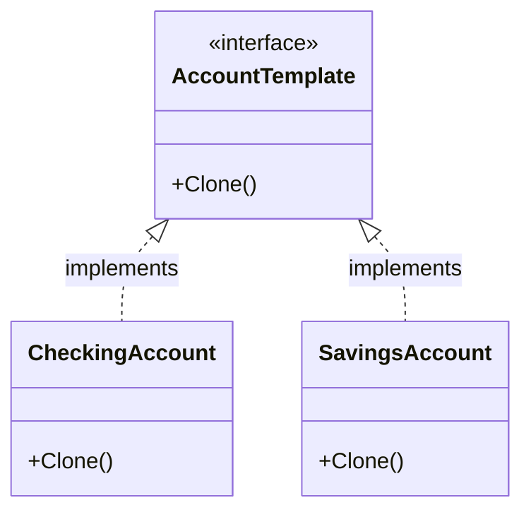

# Prototype Pattern

## Problem Statement

Creating new objects from scratch can be expensive when:
- Object initialization is costly (database queries, file I/O, complex calculations)
- Objects have many fields that need to be set
- You need multiple similar objects with slight variations

## Real-World Scenario

**JoshBank Account Templates**: JoshBank has various account templates (Checking, Savings, Investment) with predefined configurations (interest rates, fees, features). Creating a new account from scratch requires setting up all these configurations, calculating rates, and initializing features. Instead, we clone existing templates and customize them for each customer.

## Core Components

1. **Prototype Interface**: Declares the Clone() method
2. **Concrete Prototypes**: Implement cloning for specific types
3. **Prototype Registry (Optional)**: Stores and manages prototype instances
4. **Client Code**: Clones prototypes instead of creating from scratch

## Structure



## Implementation Walkthrough

1. **Define Prototype Interface**: Declare Clone() method
2. **Implement Concrete Prototypes**: Each type implements cloning
3. **Deep vs Shallow Copy**: Decide based on object structure
4. **Optional Registry**: Store pre-configured prototypes
5. **Clone and Customize**: Client clones and modifies as needed

## When to Use

✅ **Use when:**
- Object creation is expensive
- You need many similar objects with variations
- You want to avoid subclass explosion
- Objects should be independent of how they're created

⚠️ **Cautions:**
- Deep copying complex objects can be tricky
- Circular references need special handling
- May be overkill for simple objects
- In Go, consider using struct literals for simple cases

## Running the Example

```bash
cd creational/prototype
go run main.go
```

## Key Takeaways

- Prototype creates new objects by copying existing ones
- Avoids expensive initialization by cloning
- Useful when object creation is more expensive than copying
- In Go, implement Clone() method for prototype pattern
