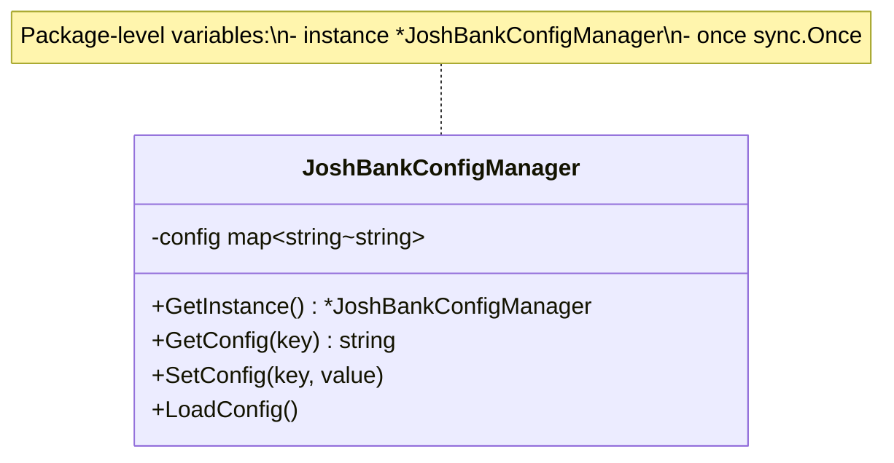
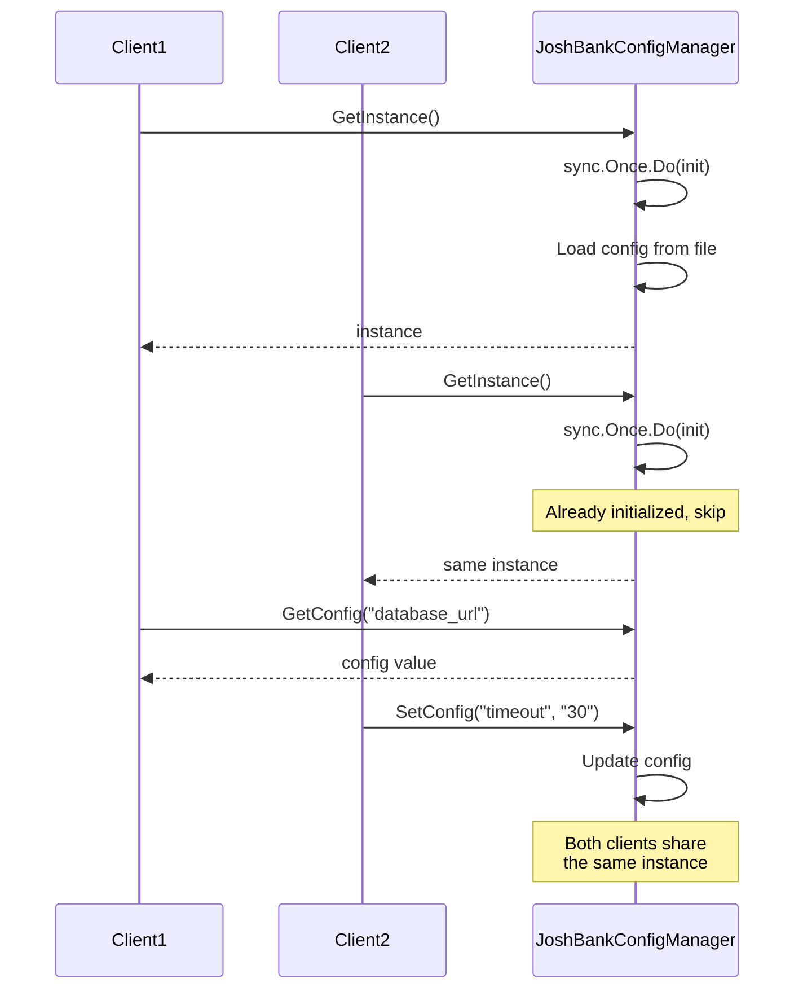

# Singleton Pattern

## Problem Statement

In many applications, we need to ensure that a class has only one instance and provide a global point of access to it. Creating multiple instances could lead to:
- Wasted resources (e.g., multiple database connections)
- Inconsistent state across the application
- Conflicts in resource management

## Real-World Scenario

**JoshBank Configuration Manager**: JoshBank needs a single configuration manager that loads settings from a file once and provides access throughout the application. Multiple instances would waste memory and could lead to inconsistent configurations across different banking modules (payments, KYC, risk management).

## Core Components

1. **Singleton Struct**: The struct that will have only one instance
2. **Private Instance Variable**: Holds the single instance (package-level variable)
3. **sync.Once**: Ensures thread-safe initialization
4. **GetInstance() Method**: Public method to access the singleton instance

## Diagrams

### Class Diagram



### Sequence Diagram



## Implementation Walkthrough

1. **Package-level variables**: Store the singleton instance and sync.Once
2. **Private constructor logic**: Initialize the instance inside sync.Once.Do()
3. **Public accessor**: GetInstance() returns the singleton instance
4. **Thread-safety**: sync.Once guarantees the instance is created only once, even with concurrent access

## When to Use

✅ **Use when:**
- You need exactly one instance of a class
- Global access point is required
- Lazy initialization is beneficial
- Resource management requires single point of control

⚠️ **Cautions:**
- Can make unit testing difficult (consider dependency injection)
- May hide dependencies in the code
- Can introduce global state (use sparingly)
- In Go, consider using package-level initialization for simpler cases

## Running the Example

```bash
cd creational/singleton
go run main.go
```

## Key Takeaways

- Singleton ensures a class has only one instance
- sync.Once provides thread-safe lazy initialization in Go
- Useful for shared resources like configuration, logging, or connection pools
- Balance between convenience and testability
