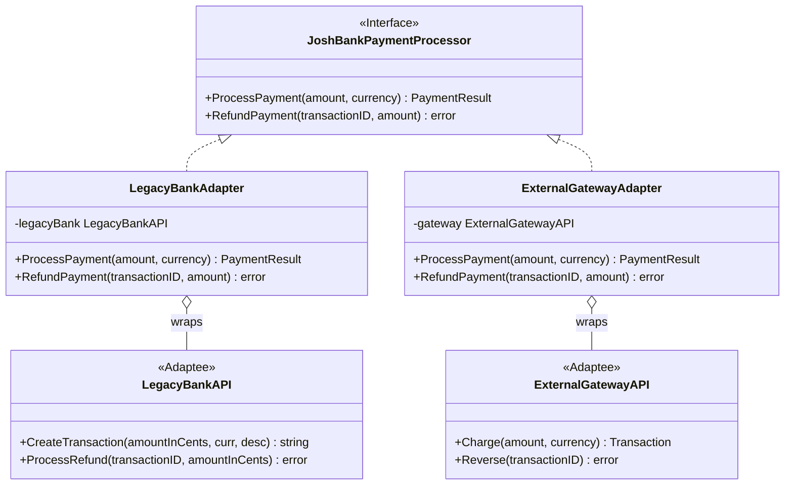
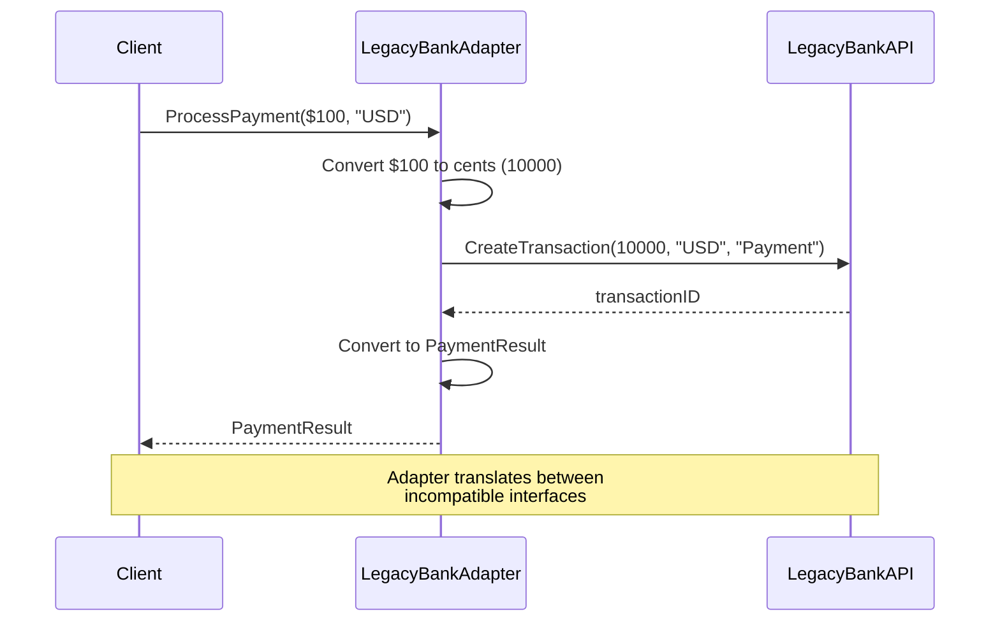

# Adapter Pattern

## Problem Statement

When you need to use a class with an incompatible interface, you face challenges:
- Existing code expects a specific interface
- Third-party library has a different interface
- Cannot modify the existing code or library
- Need to make incompatible interfaces work together

## Real-World Scenario

**JoshBank Payment Gateway Integration**: JoshBank has a standard payment interface for processing transactions. The bank needs to integrate legacy banking systems and external payment gateways that have different APIs. An adapter translates JoshBank's interface to each provider's API without modifying either the core system or the third-party code.

## Core Components

1. **Target Interface**: The interface your application expects (JoshBankPaymentProcessor)
2. **Adaptee**: The existing class with incompatible interface (Legacy Bank API, External Gateway)
3. **Adapter**: Wraps the adaptee and implements the target interface
4. **Client**: Uses the target interface

## Diagrams

### Class Diagram



### Sequence Diagram



## Implementation Walkthrough

1. **Define Target Interface**: The interface your code expects
2. **Identify Adaptee**: The incompatible class/library
3. **Create Adapter**: Implements target interface, wraps adaptee
4. **Translate Calls**: Adapter converts target calls to adaptee calls
5. **Use Polymorphically**: Client uses adapter through target interface

## When to Use

✅ **Use when:**
- You need to use an existing class with incompatible interface
- Integrating third-party libraries
- Making legacy code work with new systems
- Creating reusable classes that work with unrelated classes

⚠️ **Cautions:**
- Adds indirection and complexity
- May impact performance slightly
- Don't overuse - sometimes refactoring is better

## Running the Example

```bash
cd structural/adapter
go run main.go
```

## Key Takeaways

- Adapter makes incompatible interfaces work together
- Enables integration without modifying existing code
- Common when working with third-party libraries
- In Go, often implemented through composition
