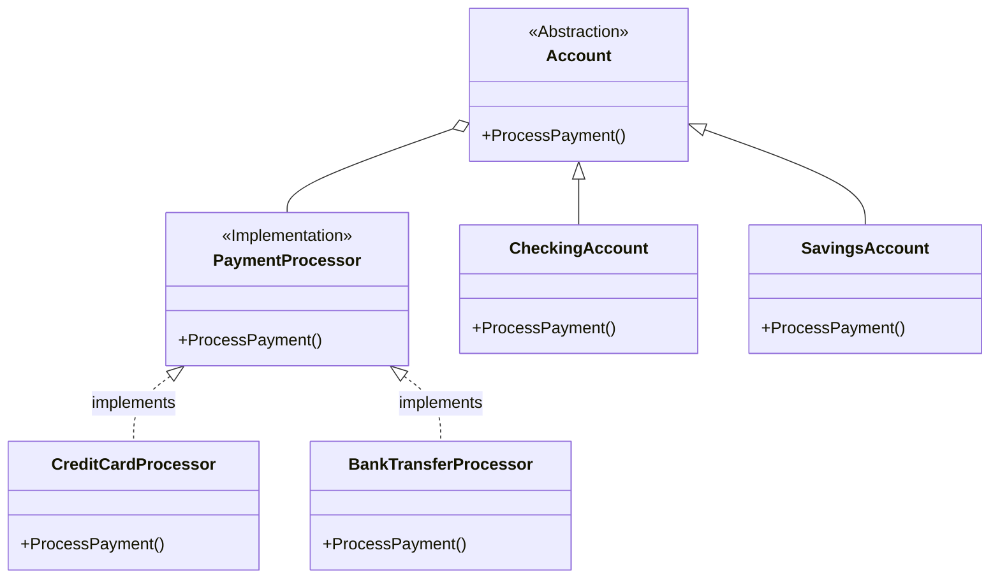

# Bridge Pattern

## Problem Statement

When you have multiple dimensions of variation in a class hierarchy, you face:
- Exponential growth of subclasses (e.g., CheckingAccountCreditCard, CheckingAccountBankTransfer, SavingsAccountCreditCard...)
- Tight coupling between abstraction and implementation
- Difficulty adding new variations
- Code duplication across similar classes

## Real-World Scenario

**JoshBank Account & Payment Processing**: JoshBank has different account types (Checking, Savings, Investment) that need to process payments through different methods (Credit Card, Bank Transfer, Cryptocurrency). Without Bridge pattern, you'd need 9 classes (CheckingAccountCreditCard, CheckingAccountBankTransfer, etc.). Bridge separates the account type from the payment processing method.

## Core Components

1. **Abstraction**: High-level interface (Account)
2. **Refined Abstraction**: Extended abstractions (CheckingAccount, SavingsAccount)
3. **Implementation Interface**: Low-level interface (PaymentProcessor)
4. **Concrete Implementations**: Payment method-specific implementations (CreditCardProcessor, BankTransferProcessor)

## Structure



## Implementation Walkthrough

1. **Identify Two Dimensions**: What varies independently? (account type vs payment processor)
2. **Create Implementation Interface**: Low-level operations (ProcessPayment)
3. **Implement Concrete Implementations**: One per payment method
4. **Create Abstraction**: High-level interface that uses implementation
5. **Extend Abstraction**: Refined abstractions for each account type

## When to Use

✅ **Use when:**
- You have multiple dimensions of variation
- You want to avoid class explosion
- Abstraction and implementation should vary independently
- You need to share implementation among multiple abstractions

⚠️ **Cautions:**
- Adds complexity with additional interfaces
- May be overkill for single dimension of variation
- Requires careful design of abstraction/implementation boundary

## Running the Example

```bash
cd structural/bridge
go run main.go
```

## Key Takeaways

- Bridge decouples abstraction from implementation
- Prevents class explosion in multi-dimensional hierarchies
- Allows independent variation of both dimensions
- Promotes composition over inheritance
