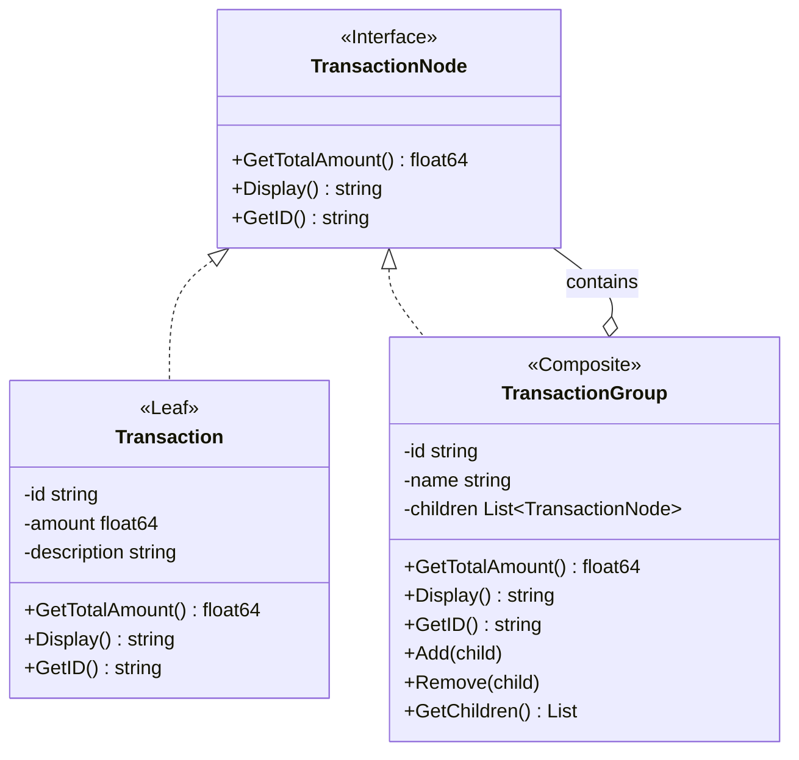
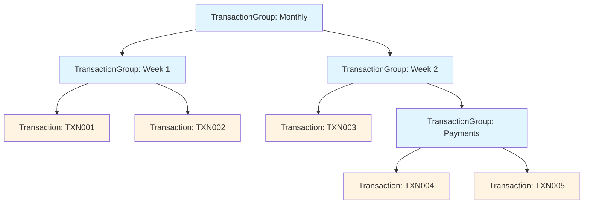

# Composite Pattern

## Problem Statement

When dealing with tree structures where individual objects and compositions should be treated uniformly:
- Need to represent part-whole hierarchies
- Client code should treat individual and composite objects the same way
- Operations should work recursively through the tree
- Adding new types of components should be easy

## Real-World Scenario

**JoshBank Transaction Groups**: JoshBank needs to organize transactions hierarchically (by date, category, account). Individual transactions and transaction groups should be treated uniformly for operations like calculating totals, searching, or generating reports. Operations should work recursively whether dealing with a single transaction or an entire group.

## Core Components

1. **Component Interface**: Common interface for all objects (TransactionNode)
2. **Leaf**: Individual objects with no children (Transaction)
3. **Composite**: Objects that can contain children (TransactionGroup)
4. **Client**: Treats all objects through the component interface

## Diagrams

### Class Diagram



### Tree Structure Example



## Implementation Walkthrough

1. **Define Component Interface**: Common operations for all nodes
2. **Implement Leaf**: Simple objects with no children
3. **Implement Composite**: Objects that contain children
4. **Recursive Operations**: Composite delegates to children
5. **Uniform Treatment**: Client uses component interface for all

## When to Use

✅ **Use when:**
- You need to represent part-whole hierarchies
- Clients should ignore difference between compositions and individuals
- Tree structures need uniform operations
- You want to simplify client code

⚠️ **Cautions:**
- Can make design overly general
- May be hard to restrict component types
- Can complicate simple hierarchies
- Consider if uniform treatment is really needed

## Running the Example

```bash
cd structural/composite
go run main.go
```

## Key Takeaways

- Composite treats individual and composite objects uniformly
- Simplifies client code through recursive composition
- Makes it easy to add new component types
- Natural fit for tree structures
