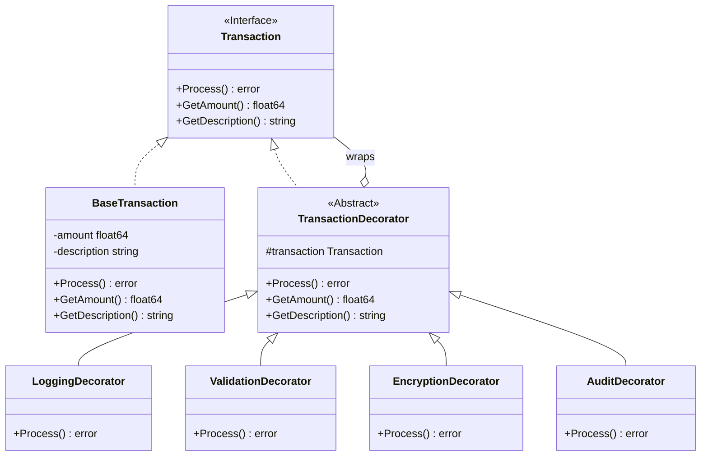
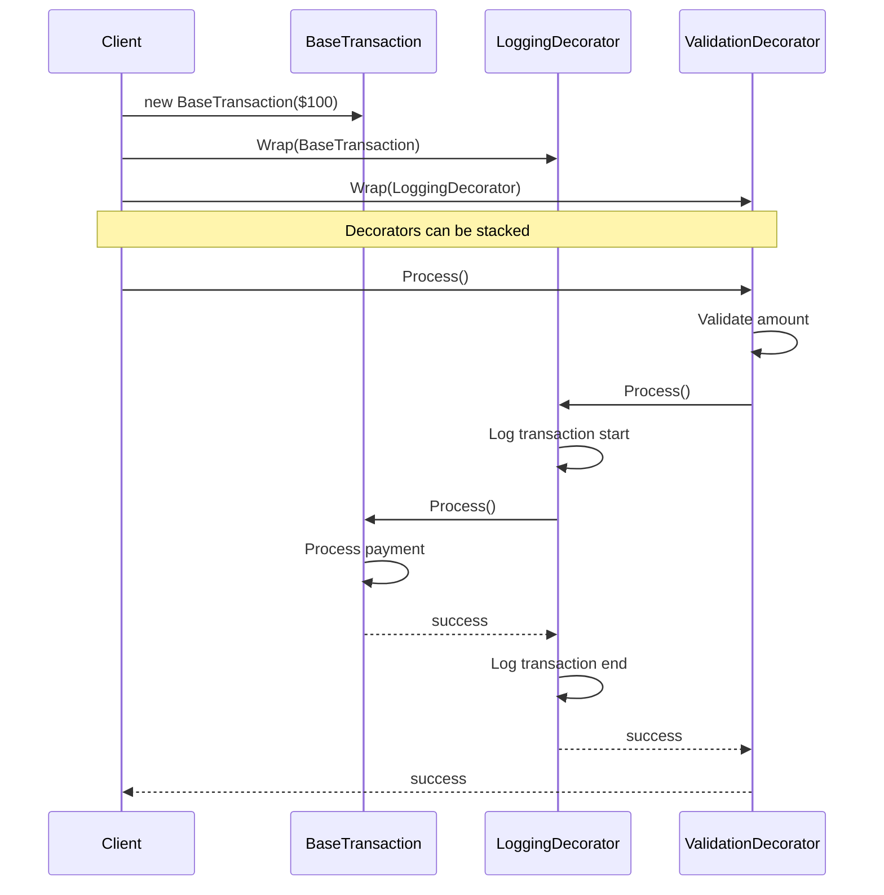

# Decorator Pattern

## Problem Statement

When you need to add responsibilities to objects dynamically without affecting other objects:
- Subclassing for every combination leads to class explosion
- Need to add/remove responsibilities at runtime
- Extending functionality should be flexible and composable
- Want to follow Open/Closed Principle

## Real-World Scenario

**JoshBank Transaction Processing**: JoshBank processes transactions that need various enhancements (logging, validation, encryption, audit trails, fees). Each enhancement changes the transaction behavior. Creating a class for every combination (LoggedTransaction, ValidatedLoggedTransaction, etc.) is impractical. Decorators allow adding these features dynamically.

## Core Components

1. **Component Interface**: Defines interface for objects that can have responsibilities added (Transaction)
2. **Concrete Component**: Basic object to which decorators can be added (BaseTransaction)
3. **Decorator**: Abstract decorator that wraps a component (TransactionDecorator)
4. **Concrete Decorators**: Add specific responsibilities (LoggingDecorator, ValidationDecorator)

## Diagrams

### Class Diagram



### Sequence Diagram



## Implementation Walkthrough

1. **Define Component Interface**: Common interface for all objects
2. **Create Concrete Component**: Basic implementation
3. **Create Base Decorator**: Wraps component and implements interface
4. **Create Concrete Decorators**: Add specific behavior
5. **Compose at Runtime**: Wrap objects with decorators as needed

## When to Use

✅ **Use when:**
- Need to add responsibilities dynamically
- Extension by subclassing is impractical
- Want to add responsibilities that can be withdrawn
- Need flexible, composable enhancements

⚠️ **Cautions:**
- Can result in many small objects
- Can be complex to understand the wrapping chain
- Order of decoration may matter
- May complicate debugging

## Running the Example

```bash
cd structural/decorator
go run main.go
```

## Key Takeaways

- Decorator adds responsibilities dynamically
- More flexible than static inheritance
- Decorators can be composed and stacked
- Follows Open/Closed Principle
