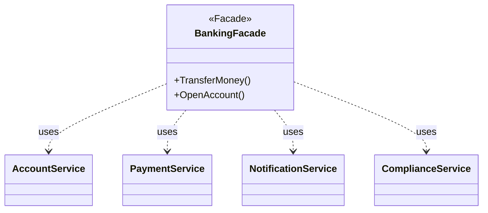

# Facade Pattern

## Problem Statement

When working with complex subsystems, clients face challenges:
- Need to interact with many classes and interfaces
- Complex initialization and coordination required
- Tight coupling to subsystem internals
- Difficult to use and understand the system

## Real-World Scenario

**JoshBank Banking System**: JoshBank has many subsystems (Account Service, Payment Service, Notification Service, Compliance Service, Audit Service). Performing a simple money transfer requires coordinating all these services in the right sequence. A facade provides a simple "TransferMoney()" method that handles all the complexity, including account verification, balance checks, compliance, notifications, and audit trails.

## Core Components

1. **Facade**: Provides simplified interface to complex subsystem (BankingFacade)
2. **Subsystem Classes**: Complex classes that do the actual work (AccountService, PaymentService, etc.)
3. **Client**: Uses the facade instead of subsystem directly

## Structure



## Implementation Walkthrough

1. **Identify Subsystems**: Find the complex classes to wrap
2. **Create Facade**: Design simple, high-level interface
3. **Delegate to Subsystems**: Facade coordinates subsystem calls
4. **Provide Convenience Methods**: Common operations as single calls
5. **Optional Direct Access**: Allow advanced users to access subsystems

## When to Use

✅ **Use when:**
- You want to provide simple interface to complex subsystem
- Need to decouple clients from subsystem components
- Want to layer your subsystems
- Subsystem is complex or difficult to understand

⚠️ **Cautions:**
- Facade can become a god object
- May hide too much functionality
- Don't prevent direct subsystem access when needed
- Keep facade focused on common use cases

## Running the Example

```bash
cd structural/facade
go run main.go
```

## Key Takeaways

- Facade simplifies complex subsystem interfaces
- Reduces dependencies between clients and subsystems
- Provides convenient methods for common operations
- Doesn't prevent direct subsystem access when needed
