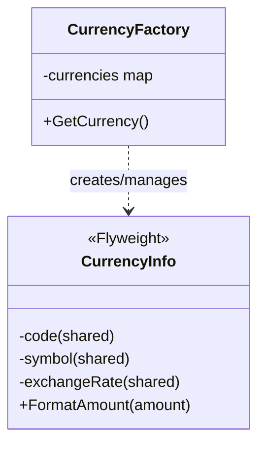

# Flyweight Pattern

## Problem Statement

When creating many similar objects leads to memory issues:
- Large number of objects consume too much memory
- Many objects share common state
- Object creation is expensive
- Need to optimize memory usage without sacrificing functionality

## Real-World Scenario

**JoshBank Currency Management**: JoshBank processes millions of transactions in various currencies. Creating a separate currency object for each transaction (with exchange rates, symbols, formatting rules) would waste memory. Flyweight shares the intrinsic state (currency properties) among all transactions with the same currency, while extrinsic state (transaction amount) remains unique.

## Core Components

1. **Flyweight Interface**: Declares methods that accept extrinsic state (CurrencyInfo)
2. **Concrete Flyweight**: Stores intrinsic (shared) state
3. **Flyweight Factory**: Creates and manages flyweight objects (CurrencyFactory)
4. **Client**: Maintains extrinsic state and uses flyweights (Transaction)

## Structure



## Implementation Walkthrough

1. **Separate State**: Identify intrinsic (shared) vs extrinsic (unique) state
2. **Create Flyweight**: Store only intrinsic state
3. **Build Factory**: Manage flyweight pool, reuse existing objects
4. **Pass Extrinsic State**: Client passes unique state to flyweight methods
5. **Optimize Memory**: Many objects share few flyweight instances

## When to Use

✅ **Use when:**
- Application uses large number of similar objects
- Memory usage is a concern
- Object state can be separated into intrinsic and extrinsic
- Many objects share common state

⚠️ **Cautions:**
- Adds complexity to codebase
- May trade memory for CPU time
- Not useful if objects don't share state
- Can make code harder to understand

## Running the Example

```bash
cd structural/flyweight
go run main.go
```

## Key Takeaways

- Flyweight minimizes memory by sharing common state
- Separates intrinsic (shared) from extrinsic (unique) state
- Factory ensures flyweights are shared properly
- Effective when many objects have similar properties
