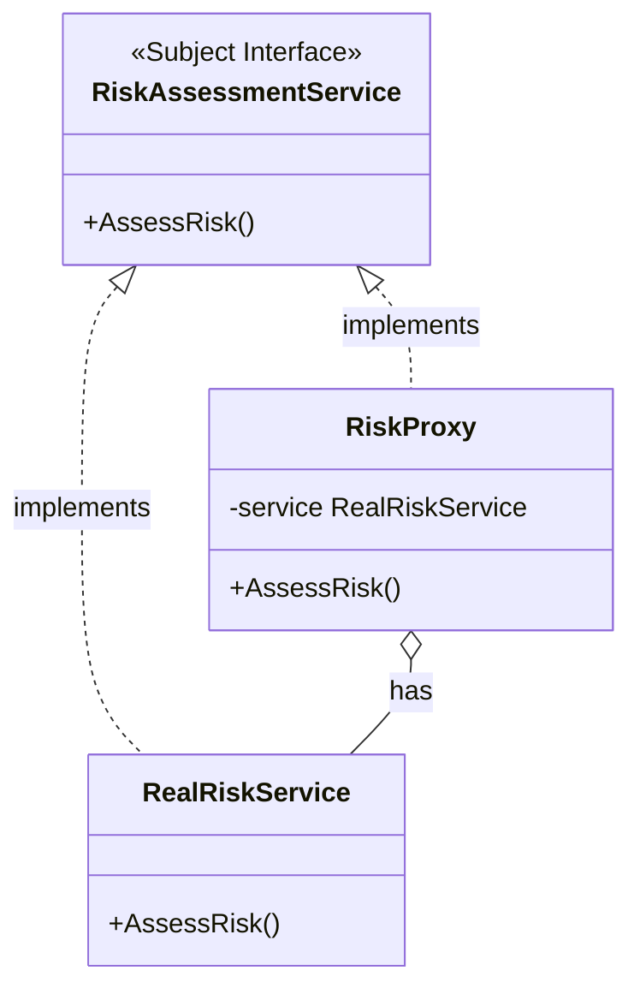

# Proxy Pattern

## Problem Statement

When direct access to an object is problematic or needs control:
- Object creation is expensive (lazy initialization needed)
- Need to control access (security, permissions)
- Want to add functionality before/after accessing object
- Remote object access requires special handling

## Real-World Scenario

**JoshBank Risk Assessment Service**: JoshBank needs to perform risk assessments for transactions, but connecting to the risk assessment service is expensive. A proxy represents the risk service, initializing the actual connection only when needed (lazy loading). Additionally, proxies can add caching, logging, and access control for compliance operations.

## Core Components

1. **Subject Interface**: Common interface for RealSubject and Proxy
2. **RealSubject**: The actual object doing the real work
3. **Proxy**: Controls access to RealSubject, adds additional behavior
4. **Client**: Works with objects through Subject interface

## Structure



## Implementation Walkthrough

1. **Define Subject Interface**: Common interface for real object and proxy
2. **Implement RealSubject**: The actual object with real functionality
3. **Create Proxy**: Implements same interface, holds reference to real object
4. **Add Proxy Logic**: Lazy loading, caching, access control, logging, etc.
5. **Transparent Usage**: Client uses proxy as if it were the real object

## When to Use

✅ **Use when:**
- Lazy initialization (virtual proxy)
- Access control (protection proxy)
- Local representative of remote object (remote proxy)
- Logging, caching, or other cross-cutting concerns

⚠️ **Cautions:**
- Adds indirection and complexity
- May introduce latency
- Can make code harder to understand
- Consider if simpler solutions exist

## Running the Example

```bash
cd structural/proxy
go run main.go
```

## Key Takeaways

- Proxy controls access to another object
- Provides placeholder until real object is needed
- Can add functionality without changing real object
- Multiple proxy types: virtual, protection, remote, caching
